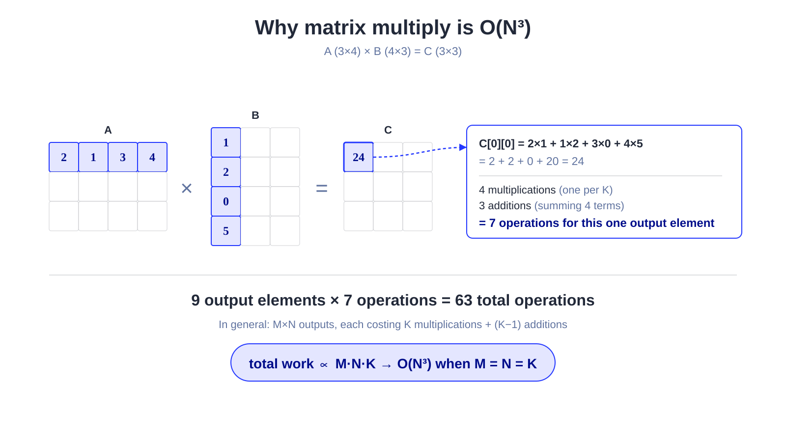
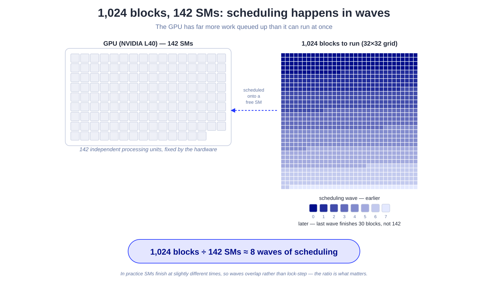
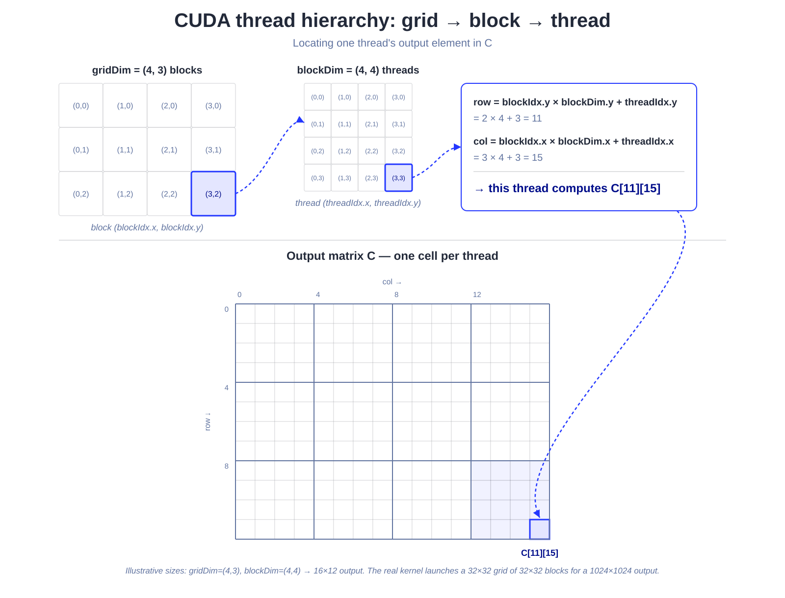

Matrix multiplication is often considered the "Hello, World!" of GPU performance engineering. It's straightforward to implement correctly, yet surprisingly challenging to optimize. On the same GPU, a naive implementation and a well-optimized kernel can differ by more than an order of magnitude in performance while producing exactly the same result.

As I began learning GPU programming, I found that the best way to deepen my understanding was to explain what I was learning. This blog is a result of that journey. In this post, I'll build and analyze four progressively optimized CUDA kernels for computing 'C = A × B' on '1024 × 1024' float32 matrices. We'll start with a naive implementation and then gradually introduce key optimization techniques: coalesced memory access, shared-memory tiling, 1D register tiling, and finally 2D register tiling. For each kernel, I'll use Nsight Compute ('ncu') to profile its performance and explain how each optimization improves the underlying memory-access pattern and overall efficiency.

## Why matmul is O(N³) on the CPU

Before touching the GPU, it's worth pausing on why matrix multiplication is expensive in the first place. The textbook CPU implementation is three nested loops:

```cpp
for (int i = 0; i < M; i++)
    for (int j = 0; j < N; j++)
        for (int p = 0; p < K; p++)
            C[i][j] += A[i][p] * B[p][j];
```

Each of the `M*N` output elements is a dot product over `K` terms, so the total work is `O(M*N*K)` — or `O(N³)` for the square case (`M = N = K`) this post uses throughout. That cubic growth is exactly what makes matmul such a natural target for parallel hardware: the work grows far faster than the input size, but every multiply-add that makes it up is independent of every other one, so nothing stops them from running at the same time.

A small example makes the operation count concrete. Take `A` as 3×4 and `B` as 4×3, so `C = A × B` comes out 3×3:



`C` has `3 * 3 = 9` output elements, and each one is a dot product over the shared dimension `K = 4` — 4 multiplications, plus 3 additions to sum the 4 products together (one fewer addition than terms). That's `9 * 4 = 36` multiplications and `9 * 3 = 27` additions, 63 scalar operations total, from just `3*4 + 4*3 = 24` input numbers. Scale that same arithmetic up to `M = N = K = 1024` and you get over two billion multiply-adds for a single matmul — a workload that's both enormous and, because every output element is computed independently, embarrassingly parallel. That combination is exactly why matmul is the canonical GPU benchmark.

## The setup

```cpp
#define M 1024
#define N 1024
#define K 1024
```

`A` is M×K, `B` is K×N, `C` is M×N. Every kernel computes the same `C`, verified against a CPU reference with `verify()`. What changes is *how* each thread gets the data it needs.

## Stage 1: Naive — one thread, one output element

A GPU isn't one big processor — it's a collection of many independent processing units called **Streaming Multiprocessors (SMs)**, each with its own cores, registers, and scheduler. CUDA's programming model exists to give you a structured way to map a problem onto that hardware: you describe your problem as a huge number of small, independent pieces of work, and the hardware takes care of handing those pieces out to whichever SMs are free.

Hardware always has a limited number of SMs. An NVIDIA L40, for example, has 142 of them. Our problem is 1024×1024, split into 32×32 tiles — that's `32 * 32 = 1,024` blocks in total, far more than 142 SMs can hold at once. So blocks don't all run simultaneously: the GPU schedules them onto SMs piece by piece, in waves, as each SM finishes its current block and frees up. Within an SM, that block's work is split further across its cores, and each core's slice of the block is identified by — you guessed it — a thread id.



CUDA exposes this two-level mapping (grid of blocks → block of threads) through three built-in variables, all up to 3-dimensional (matmul only needs `x` and `y`):

- `blockDim` — the size of a block, fixed for the whole launch: how many threads it holds along `x` and `y`.
- `blockIdx` — which block, out of the whole grid, the current thread belongs to.
- `threadIdx` — where the current thread sits inside its own block.

To get a thread's position in the *whole* problem, skip past all the earlier blocks (`blockIdx * blockDim`) and then add the thread's own offset inside its block (`+ threadIdx`):

```cpp
row = blockIdx.y * blockDim.y + threadIdx.y;
col = blockIdx.x * blockDim.x + threadIdx.x;
```



For our 1024×1024 problem with 32×32 blocks, that's a 32×32 grid of blocks, each holding 1,024 threads — one thread per output element of `C`, matching the "Threads/block" and "Outputs/thread" columns in the [benchmark configs](#benchmark-harness) below.

Put together, here's the whole kernel:

```cpp
__global__ void naive_matmul(float *A, float *B, float *C, int m, int kk, int n) {
    int row = blockIdx.y * blockDim.y + threadIdx.y;
    int col = blockIdx.x * blockDim.x + threadIdx.x;
    if (row < m && col < n) {
        float sum = 0.f;
        for (int p = 0; p < kk; p++)
            sum += A[row*kk + p] * B[p*n + col];
        C[row*n + col] = sum;
    }
}
```

Each thread owns exactly one output element and walks the full K dimension to compute it. This is correct and embarrassingly parallel, but it's bandwidth-bound in the worst way: every thread reads its own row of `A` and column of `B` straight from **global memory**, on every iteration of the inner loop. Neighboring threads in a block re-read almost the same data from `A` and `B` independently — nothing is shared, nothing is cached deliberately. For a 1024³ problem that's a lot of redundant global-memory traffic, and global memory is the slowest thing on the chip.

### A lower bound on runtime

Before chasing optimizations, it's worth working out how fast this kernel could possibly go — a lower bound set by whichever of "how much arithmetic" or "how much data movement" turns out to be bigger.

**FLOPs.** Each of the `1024 * 1024` entries of `C` is a dot product of two length-1,024 vectors: one multiply and one add per term. That multiply-add usually compiles down to a single FMA instruction, but it's still 2 floating-point operations. Total work:

```
2 * 1024³ ≈ 2.15 GFLOP
```

**Minimum memory traffic.** In the best possible case, every element of `A` and `B` is fetched from global memory exactly once, and every element of `C` is written exactly once — nothing is ever re-read:

- read `A` and `B`: `2 * 1024² * 4B ≈ 8.4MB`
- write `C`: `1024² * 4B ≈ 4.2MB`
- floor: `≈ 12.6MB`

No correct kernel can move less than that; it's a lower limit, not a target to aim for.

The L40 is rated for 90.5 TFLOP/s of fp32 throughput and 864GB/s of memory bandwidth. Hitting both numbers exactly (generous, but useful as a bound) gives:

- compute time: `2.15 GFLOP / 90.5 TFLOP/s ≈ 0.024 ms`
- memory time: `12.6MB / 864GB/s ≈ 0.015 ms`

Compute takes about `1.6×` longer than the minimum memory transfer, so an ideal kernel at this size would be *mildly* compute-bound — but only mildly. That margin is much thinner than the "compute dominates by 10×" result often quoted for matmul, and the reason is size: arithmetic intensity (FLOPs moved per byte) scales with the problem, since FLOPs grow as `N³` while bytes grow only as `N²`. A `1024³` problem sits much closer to the point where compute time and memory time are equal than a much larger one would. There's very little slack here — any kernel that moves meaningfully more than that ~12.6MB floor immediately falls behind the compute bound and becomes memory-bound instead.

That's exactly what the naive kernel does. It has no reuse whatsoever: each of the `1024 * 1024` threads independently streams its own full row of `A` and column of `B` — `1,024 + 1,024` floats — straight from global memory, once per thread:

```
1,048,576 threads × 2,048 floats × 4B ≈ 8.6GB of reads
```

— roughly **680× more traffic** than the 12.6MB floor requires. Even at peak bandwidth, moving 8.6GB takes on the order of 10ms, against a 0.024ms compute-bound floor — three orders of magnitude apart. The naive kernel isn't slow because the GPU runs out of arithmetic throughput; it's slow because almost everything it reads is a repeat. Every optimization in the rest of this post is really just different ways of closing that gap between data moved and data actually needed.

## Stage 2: Shared-memory tiling — cache a block, reuse it

```cpp
#define TILE 32

__global__ void tiled_matmul(float *A, float *B, float *C, int m, int kk, int n) {
    __shared__ float As[TILE][TILE];
    __shared__ float Bs[TILE][TILE];

    int tx = threadIdx.x, ty = threadIdx.y;
    int row = blockIdx.y * TILE + ty;
    int col = blockIdx.x * TILE + tx;
    float sum = 0.f;

    for (int bk = 0; bk < kk; bk += TILE) {
        As[ty][tx] = (row < m && bk + tx < kk) ? A[row*kk + bk + tx] : 0.f;
        Bs[ty][tx] = (bk + ty < kk && col < n) ? B[(bk + ty)*n + col] : 0.f;
        __syncthreads();

        for (int p = 0; p < TILE; p++)
            sum += As[ty][p] * Bs[p][tx];
        __syncthreads();
    }

    if (row < m && col < n)
        C[row*n + col] = sum;
}
```

The key idea: a whole 32×32 thread block cooperatively loads one 32×32 tile of `A` and one of `B` into **shared memory** — an on-chip scratchpad that's roughly two orders of magnitude faster than global memory. Every thread in the block loads exactly one element, then `__syncthreads()` makes sure the tile is fully populated before anyone reads it. From there, all 1024 threads in the block reuse those two tiles for the entire inner-product step, instead of each thread re-fetching from DRAM.

This turns O(TILE) redundant global loads per element into O(1) — each global element is loaded once per tile and reused TILE times from shared memory. The two `__syncthreads()` calls are the cost of this reuse: one to make sure loads finish before compute starts, one to make sure compute finishes before the next tile overwrites `As`/`Bs`.

## Stage 3: 1D register tiling — one thread, multiple output rows

Shared memory is fast, but it's not free — reading it still costs an instruction and it's shared across the whole warp. The next lever is **registers**, which are private to each thread and even faster. The idea: instead of one thread computing one output element, let it compute a whole column strip and hold the accumulators in registers.

```cpp
#define TM 8   // rows each thread owns

__global__ void one_D_TILE(float *A, float *B, float *C) {
    __shared__ float As[TILE][TILE];
    __shared__ float Bs[TILE][TILE];

    int tx  = threadIdx.x;
    int ty  = threadIdx.y;
    int row = blockIdx.y * TILE + ty * TM;
    int col = blockIdx.x * TILE + tx;

    float acc[TM] = {0.0f};

    for (int bk = 0; bk < K; bk += TILE) {
        for (int i = 0; i < TM; i++) {
            int a_row = row + i, a_col = bk + tx;
            As[ty*TM + i][tx] = (a_row < M && a_col < K) ? A[a_row*K + a_col] : 0.0f;
        }
        for (int i = 0; i < TM; i++) {
            int b_row = bk + ty*TM + i;
            Bs[ty*TM + i][tx] = (b_row < K && col < N) ? B[b_row*N + col] : 0.0f;
        }
        __syncthreads();

        for (int p = 0; p < TILE; p++) {
            float b_val = Bs[p][tx];              // one shared-mem read, reused TM times
            for (int i = 0; i < TM; i++)
                acc[i] += As[ty*TM + i][p] * b_val;
        }
        __syncthreads();
    }

    for (int i = 0; i < TM; i++) {
        int c_row = row + i;
        if (c_row < M && col < N)
            C[c_row*N + col] = acc[i];
    }
}
```

The block shrinks from (32, 32) to (32, 4) — 128 threads instead of 1024 — but each thread now produces `TM = 8` output rows instead of 1, so the block still covers the same 32×32 output tile. The payoff is in the compute loop: `Bs[p][tx]` is read from shared memory **once** and reused across all 8 accumulators (`b_val`), instead of being re-read from shared memory 8 times. That's 8x fewer shared-memory reads per useful multiply-add, trading shared-memory bandwidth for register bandwidth, which is effectively free.

## Stage 4: 2D register tiling — outer products in registers

The natural extension: if owning multiple rows per thread helped, why not own a whole sub-tile? Each thread now computes a `TM × TN` = 8×4 block of the output using a classic **outer-product** update. (`TN` is smaller than `TM` on purpose — a rectangular tile, not a square one; more on why below.)

```cpp
__global__ void reg2D_TILE(float *A, float *B, float *C) {
    __shared__ float As[TILE+1][TILE];   // padded so a column read doesn't
    __shared__ float Bs[TILE][TILE+1];   // all land on the same memory bank

    int tx = threadIdx.x, ty = threadIdx.y;
    int row = blockIdx.y * TILE + ty * TM;
    int col = blockIdx.x * TILE + tx * TN;

    float acc[TM][TN] = {};

    for (int bk = 0; bk < K; bk += TILE) {
        // cooperative load of As, Bs (each thread fills a TM×TN patch)
        // ...
        __syncthreads();

        for (int p = 0; p < TILE; p++) {
            float regA[TM], regB[TN];
            for (int i = 0; i < TM; i++) regA[i] = As[ty*TM + i][p];
            for (int j = 0; j < TN; j++) regB[j] = Bs[p][tx*TN + j];

            for (int i = 0; i < TM; i++)
                for (int j = 0; j < TN; j++)
                    acc[i][j] += regA[i] * regB[j];   // pure register arithmetic
        }
        __syncthreads();
    }
    // store acc[TM][TN] to C
}
```

Now the block is (8, 4) = 32 threads, each doing 32 accumulators and an 8×4 outer product per k-step. Per k-step, the thread does `TM + TN` = 12 shared-memory reads (`regA`, `regB`) to produce `TM * TN` = 32 fused multiply-adds — still a big jump from stage 2's one-read-per-FMA, though a slightly lower ratio than a square 8×8 tile would give. That's a deliberate trade: `TN = 4` lines up exactly with a 128-bit `float4` load, which is what the vectorized-load kernel in the [full code](#full-code) below spends that shape on. This is the same idea GPU BLAS libraries lean on hardest — maximize **arithmetic intensity** (FLOPs per byte moved) at every level of the memory hierarchy: global → shared → register.

## Benchmark harness

```cpp
float time_kernel(void (*launch)(float*, float*, float*, int, int, int, dim3, dim3),
                  float *dA, float *dB, float *dC,
                  dim3 grid, dim3 block, int reps) {
    cudaEvent_t start, stop;
    cudaEventCreate(&start); cudaEventCreate(&stop);
    launch(dA, dB, dC, M, K, N, grid, block);   // warmup
    cudaDeviceSynchronize();

    cudaEventRecord(start);
    for (int i = 0; i < reps; i++)
        launch(dA, dB, dC, M, K, N, grid, block);
    cudaEventRecord(stop);
    cudaEventSynchronize(stop);

    float ms = 0.f;
    cudaEventElapsedTime(&ms, start, stop);
    return ms / reps;
}
```

Each kernel gets a warmup launch (so the timing isn't polluted by first-touch effects) and then 20 timed launches, averaged, using CUDA events for device-side timing. GFLOP/s is computed from the standard GEMM FLOP count, `2 * M * N * K`.

Grid/block configs for each stage:

| Kernel | Block | Threads/block | Outputs/thread |
|---|---|---|---|
| Naive | (32, 32) | 1024 | 1 |
| Tiled-smem | (32, 32) | 1024 | 1 |
| Reg1D | (32, 4) | 128 | 8 (1×8) |
| Reg2D | (8, 4) | 32 | 32 (8×4) |

## Results

Running on a 1024×1024×1024 `float32` GEMM, 20 reps each, the shape of the results looks like this (numbers will vary by GPU — fill in your own run):

```
=== Matmul benchmark  1024x1024x1024  (avg over 20 runs) ===

Kernel          ms         GFLOP/s   Correct
──────────────  ────────  ──────────────  ───────
Naive            X.XXX          XXX.XX     yes
Tiled-smem       X.XXX          XXX.XX     yes
Reg1D            X.XXX          XXX.XX     yes
Reg2D            X.XXX          XXX.XX     yes

Speedup vs Naive:
  Tiled-smem     X.XXx
  Reg1D          X.XXx
  Reg2D          X.XXx
```

Each stage should show a clear step up in GFLOP/s, and the pattern generalizes past this one 1024³ problem: shared-memory tiling cuts redundant global loads, and register tiling cuts redundant shared-memory reads by amortizing each load over a growing block of output.

## What's next

The natural next step past 2D register tiling is **double buffering**: overlapping the shared-memory load for k-step `bk+TILE` with the compute for k-step `bk`, using asynchronous copy instructions (`cp.async` on Ampere+) so the memory pipeline and the FMA pipeline run concurrently instead of being separated by `__syncthreads()`. That's a bigger jump in complexity — it's the difference between a kernel you can reason about in an afternoon and one that starts looking like what's inside cuBLAS — so it's a good stopping point, and a good topic for a follow-up post once it's implemented and benchmarked.

## Full code

<details>
<summary>naive_matmul, tiled_matmul, one_D_TILE, reg2D_TILE, vect_reg2D_TILE, vect_reg2D_TILE_cp_async, and the benchmark harness</summary>

The `_cp_async` kernel uses `cp.async` PTX instructions and needs an Ampere-or-newer GPU (compute capability 8.0+) to run; everything else here compiles and runs from Pascal onward. Also on GitHub: [cuda-performance-engineering](https://github.com/AvinashQtC/cuda-performance-engineering).

```cpp
#include <stdio.h>
#include <stdlib.h>
#include <cuda_runtime.h>

#define M 1024
#define N 1024
#define K 1024

// ─── Tile / register-tile sizes ───────────────────────────────────────────────
// TILE  : shared-memory tile edge (rows and cols covered per block per K-step)
// TM    : rows each thread owns  (1D tiling: TM rows × 1 col)
//                                (2D tiling: TM rows × TN cols)
// TN    : cols each thread owns in 2D tiling (also the float4 vector width)
// Block for 1D: (TILE, TILE/TM) = (32, 4)  → 128 threads
// Block for 2D: (TILE/TN, TILE/TM) = (8, 4) → 32 threads
#define TILE 32
#define TM   8
#define TN   4

// ─── CPU reference ────────────────────────────────────────────────────────────
void cpu_matmul(float *A, float *B, float *C, int m, int kk, int n) {
    for (int i = 0; i < m; i++)
        for (int j = 0; j < n; j++) {
            float sum = 0.f;
            for (int p = 0; p < kk; p++)
                sum += A[i*kk + p] * B[p*n + j];
            C[i*n + j] = sum;
        }
}

// ─── Naive kernel ─────────────────────────────────────────────────────────────
__global__ void naive_matmul(float *A, float *B, float *C, int m, int kk, int n) {
    int row = blockIdx.y * blockDim.y + threadIdx.y;
    int col = blockIdx.x * blockDim.x + threadIdx.x;
    if (row < m && col < n) {
        float sum = 0.f;
        for (int p = 0; p < kk; p++)
            sum += A[row*kk + p] * B[p*n + col];
        C[row*n + col] = sum;
    }
}

// ─── Shared-memory tiled kernel ───────────────────────────────────────────────
__global__ void tiled_matmul(float *A, float *B, float *C, int m, int kk, int n) {
    __shared__ float As[TILE][TILE];
    __shared__ float Bs[TILE][TILE];

    int tx = threadIdx.x, ty = threadIdx.y;
    int row = blockIdx.y * TILE + ty;
    int col = blockIdx.x * TILE + tx;
    float sum = 0.f;

    for (int bk = 0; bk < kk; bk += TILE) {
        int a_col = bk + tx;
        As[ty][tx] = (row < m && a_col < kk) ? A[row*kk + a_col] : 0.f;

        int b_row = bk + ty;
        Bs[ty][tx] = (b_row < kk && col < n) ? B[b_row*n + col] : 0.f;

        __syncthreads();
        for (int p = 0; p < TILE; p++)
            sum += As[ty][p] * Bs[p][tx];
        __syncthreads();
    }

    if (row < m && col < n)
        C[row*n + col] = sum;
}

// ─── 1D register-tiled kernel ─────────────────────────────────────────────────
// Block shape : (TILE, TILE/TM) = (32, 4)  → 128 threads
// threadIdx.x : column inside the TILE-wide output block   [0 .. TILE-1]
// threadIdx.y : which group of TM rows this thread owns    [0 .. TILE/TM-1]
// Each thread:
//   • loads TM rows of As (column tx) and TM rows of Bs (column tx)
//   • accumulates TM partial sums in registers
// Shared memory: As[TILE][TILE], Bs[TILE][TILE]  (same layout as tiled kernel)
__global__ void one_D_TILE(float *A, float *B, float *C) {
    __shared__ float As[TILE][TILE];
    __shared__ float Bs[TILE][TILE];

    int tx  = threadIdx.x;                        // col index inside tile
    int ty  = threadIdx.y;                        // row-group index
    int row = blockIdx.y * TILE + ty * TM;        // first global row for this thread
    int col = blockIdx.x * TILE + tx;             // global column

    float acc[TM] = {0.0f};

    for (int bk = 0; bk < K; bk += TILE) {
        // ── Load TM rows of A into As[ty*TM .. ty*TM+TM-1][tx] ──
        for (int i = 0; i < TM; i++) {
            int a_row = row + i;
            int a_col = bk + tx;
            As[ty*TM + i][tx] = (a_row < M && a_col < K) ? A[a_row*K + a_col] : 0.0f;
        }

        // ── Load TM rows of B into Bs[ty*TM .. ty*TM+TM-1][tx] ──
        for (int i = 0; i < TM; i++) {
            int b_row = bk + ty*TM + i;
            Bs[ty*TM + i][tx] = (b_row < K && col < N) ? B[b_row*N + col] : 0.0f;
        }

        __syncthreads();

        // ── Compute: hoist Bs[p][tx] out of the row loop ──
        for (int p = 0; p < TILE; p++) {
            float b_val = Bs[p][tx];              // one smem read reused TM times
            for (int i = 0; i < TM; i++)
                acc[i] += As[ty*TM + i][p] * b_val;
        }

        __syncthreads();
    }

    // ── Store TM results ──
    for (int i = 0; i < TM; i++) {
        int c_row = row + i;
        if (c_row < M && col < N)
            C[c_row*N + col] = acc[i];
    }
}

// ─── 2D register-tiled kernel ─────────────────────────────────────────────────
// Block shape : (TILE/TN, TILE/TM) = (8, 4)  → 32 threads
// threadIdx.x : col-group index   [0 .. TILE/TN-1]
// threadIdx.y : row-group index   [0 .. TILE/TM-1]
// Each thread owns a TM×TN sub-tile of the output.
//
// Shared memory loading mirrors the 1D kernel:
//   thread (ty, tx) fills As[ty*TM .. ty*TM+TM-1][tx*TN .. tx*TN+TN-1]
//   (the full TILE×TILE tile is covered collectively by all TILE/TN × TILE/TM threads)
//
// Padded to TILE+1 on the leading dimension to avoid shared-memory bank conflicts.
//
// Inner loop: for each k-step p, load regA[TM] from As column p,
//             load regB[TN] from Bs row p, then outer-product into acc[TM][TN].
__global__ void reg2D_TILE(float *A, float *B, float *C) {
    __shared__ float As[TILE+1][TILE];
    __shared__ float Bs[TILE][TILE+1];

    int tx  = threadIdx.x;                        // col-group index
    int ty  = threadIdx.y;                        // row-group index
    int row = blockIdx.y * TILE + ty * TM;        // first global row
    int col = blockIdx.x * TILE + tx * TN;        // first global col

    float acc[TM][TN] = {};

    for (int bk = 0; bk < K; bk += TILE) {
        // ── Load As: thread (ty,tx) fills a TM×TN block of As ──
        for (int i = 0; i < TM; i++) {
            int a_row = row + i;
            for (int j = 0; j < TN; j++) {
                int a_col = bk + tx*TN + j;
                As[ty*TM + i][tx*TN + j] =
                    (a_row < M && a_col < K) ? A[a_row*K + a_col] : 0.0f;
            }
        }

        // ── Load Bs: thread (ty,tx) fills a TM×TN block of Bs ──
        for (int i = 0; i < TM; i++) {
            int b_row = bk + ty*TM + i;
            for (int j = 0; j < TN; j++) {
                int b_col = col + j;
                Bs[ty*TM + i][tx*TN + j] =
                    (b_row < K && b_col < N) ? B[b_row*N + b_col] : 0.0f;
            }
        }

        __syncthreads();

        // ── Outer-product over TILE k-steps ──
        for (int p = 0; p < TILE; p++) {
            float regA[TM], regB[TN];

            // Load one column of As (this thread's TM rows) into registers
            for (int i = 0; i < TM; i++)
                regA[i] = As[ty*TM + i][p];

            // Load one row of Bs (this thread's TN cols) into registers
            for (int j = 0; j < TN; j++)
                regB[j] = Bs[p][tx*TN + j];

            // TM×TN outer product — pure register arithmetic
            for (int i = 0; i < TM; i++)
                for (int j = 0; j < TN; j++)
                    acc[i][j] += regA[i] * regB[j];
        }

        __syncthreads();
    }

    // ── Store TM×TN results ──
    for (int i = 0; i < TM; i++) {
        int c_row = row + i;
        for (int j = 0; j < TN; j++) {
            int c_col = col + j;
            if (c_row < M && c_col < N)
                C[c_row*N + c_col] = acc[i][j];
        }
    }
}

// ─── 2D register-tiled kernel, float4 vectorized global loads ────────────────
// Same output tiling as reg2D_TILE (TM×TN per thread, (TILE/TN, TILE/TM) block),
// but each thread pulls a 16-byte float4 out of global memory per row instead of
// TN separate scalar loads. As is stored transposed ([col][row]) so the float4
// write into shared memory lands contiguously.
// Assumes K and N are multiples of TN (=4) so the float4 loads stay in bounds.
__global__ void vect_reg2D_TILE(float *A, float *B, float *C) {
    __shared__ float As[TILE+1][TILE];
    __shared__ float Bs[TILE][TILE+1];

    int tx  = threadIdx.x;                        // col-group index
    int ty  = threadIdx.y;                        // row-group index
    int row = blockIdx.y * TILE + ty * TM;        // first global row
    int col = blockIdx.x * TILE + tx * TN;        // first global col

    float acc[TM][TN] = {};

    for (int bk = 0; bk < K; bk += TILE) {
        // ── Load As: thread (ty,tx) fills a TM×TM block of As ──
        for (int i = 0; i < TM; i++) {
            int a_row = row + i;
            int a_col = bk + tx*TN;

            float4 a_vec =  *((float4*)(A + a_row*K + a_col));

            As[tx*TN+0][ty*TM+i] = a_vec.x;
            As[tx*TN+1][ty*TM+i] = a_vec.y;
            As[tx*TN+2][ty*TM+i] = a_vec.z;
            As[tx*TN+3][ty*TM+i] = a_vec.w;
        }

        // ── Load Bs: thread (ty,tx) fills a TM×TM block of Bs ──
        for (int i = 0; i < TM; i++) {
            int b_row = bk + ty*TM + i;

            float4 b_vec = *((float4*)(B + b_row*N + col));

            Bs[ty*TM+i][tx*TN+0] = b_vec.x;
            Bs[ty*TM+i][tx*TN+1] = b_vec.y;
            Bs[ty*TM+i][tx*TN+2] = b_vec.z;
            Bs[ty*TM+i][tx*TN+3] = b_vec.w;
        }

        __syncthreads();

        // ── Outer-product over TILE k-steps ──
        for (int p = 0; p < TILE; p++) {
            float regA[TM], regB[TN];

            // Load one column of As (this thread's TM rows) into registers
            for (int i = 0; i < TM; i++)
                regA[i] = As[p][ty*TM + i];

            // Load one row of Bs (this thread's TN cols) into registers
            for (int j = 0; j < TN; j++)
                regB[j] = Bs[p][tx*TN + j];

            // TM×TN outer product — pure register arithmetic
            for (int i = 0; i < TM; i++)
                for (int j = 0; j < TN; j++)
                    acc[i][j] += regA[i] * regB[j];
        }

        __syncthreads();
    }

    // ── Store TM×TN results ──
    for (int i = 0; i < TM; i++) {
        int c_row = row + i;
        for (int j = 0; j < TN; j++) {
            int c_col = col + j;
            if (c_row < M && c_col < N)
                C[c_row*N + c_col] = acc[i][j];
        }
    }
}

// ─── 2D register-tiled kernel, float4 loads + cp.async double buffering ──────
// Same TM×TN output tiling as above, but the shared-memory tiles are double
// buffered (As/Bs[2][...]) so the load for k-step bk+TILE is issued via
// cp.async while the compute for k-step bk is still running, overlapping the
// memory and FMA pipelines instead of separating them with __syncthreads().
//
// Assumptions:
// TILE, TM, TN, M, N, K are compile-time constants or macros.
// Recommended: TN = 4 for float4 vectorized loads.
// A is M x K, B is K x N, C is M x N, all row-major.
__global__ void vect_reg2D_TILE_cp_async(float *A, float *B, float *C)
{
    __shared__ float As[2][TILE+1][TILE];
    __shared__ float Bs[2][TILE][TILE+1];

    int tx  = threadIdx.x;
    int ty  = threadIdx.y;

    int row = blockIdx.y * TILE + ty * TM;
    int col = blockIdx.x * TILE + tx * TN;

    float acc[TM][TN] = {};

    int curr = 0;
    int next = 1;

    // ============================================================
    // Preload first tile: bk = 0 into buffer curr
    // ============================================================

    for (int i = 0; i < TM; i++)
    {
        int a_row = row + i;
        int a_col = tx * TN;

        if (a_row < M && a_col + 3 < K)
        {
            float *smem_ptr = &As[curr][ty * TM + i][tx * TN];
            float *gmem_ptr = A + a_row * K + a_col;

            unsigned smem =
                static_cast<unsigned>(
                    __cvta_generic_to_shared(smem_ptr));

            asm volatile(
                "cp.async.cg.shared.global [%0], [%1], 16;\n"
                :
                : "r"(smem), "l"(gmem_ptr)
            );
        }
    }

    for (int i = 0; i < TM; i++)
    {
        int b_row = ty * TM + i;

        if (b_row < K && col + 3 < N)
        {
            float *smem_ptr = &Bs[curr][ty * TM + i][tx * TN];
            float *gmem_ptr = B + b_row * N + col;

            unsigned smem =
                static_cast<unsigned>(
                    __cvta_generic_to_shared(smem_ptr));

            asm volatile(
                "cp.async.cg.shared.global [%0], [%1], 16;\n"
                :
                : "r"(smem), "l"(gmem_ptr)
            );
        }
    }

    // First tile must be fully ready before entering main loop.
    asm volatile("cp.async.commit_group;\n" ::);
    asm volatile("cp.async.wait_group 0;\n" ::);

    __syncthreads();

    // ============================================================
    // Main loop
    // ============================================================

    for (int bk = 0; bk < K; bk += TILE)
    {
        int next_bk = bk + TILE;

        // ========================================================
        // 1. Issue async preload for next tile into buffer next
        // ========================================================

        if (next_bk < K)
        {
            for (int i = 0; i < TM; i++)
            {
                int a_row = row + i;
                int a_col = next_bk + tx * TN;

                if (a_row < M && a_col + 3 < K)
                {
                    float *smem_ptr =
                        &As[next][ty * TM + i][tx * TN];

                    float *gmem_ptr =
                        A + a_row * K + a_col;

                    unsigned smem =
                        static_cast<unsigned>(
                            __cvta_generic_to_shared(smem_ptr));

                    asm volatile(
                        "cp.async.cg.shared.global [%0], [%1], 16;\n"
                        :
                        : "r"(smem), "l"(gmem_ptr)
                    );
                }
            }

            for (int i = 0; i < TM; i++)
            {
                int b_row = next_bk + ty * TM + i;

                if (b_row < K && col + 3 < N)
                {
                    float *smem_ptr =
                        &Bs[next][ty * TM + i][tx * TN];

                    float *gmem_ptr =
                        B + b_row * N + col;

                    unsigned smem =
                        static_cast<unsigned>(
                            __cvta_generic_to_shared(smem_ptr));

                    asm volatile(
                        "cp.async.cg.shared.global [%0], [%1], 16;\n"
                        :
                        : "r"(smem), "l"(gmem_ptr)
                    );
                }
            }

            asm volatile("cp.async.commit_group;\n" ::);
        }

        // ========================================================
        // 2. Wait BEFORE computing current tile
        // ========================================================
        //
        // If next_bk < K:
        //   We allow one newest group to remain in-flight.
        //   That newest group is the next tile.
        //
        // If this is the last tile:
        //   There is no future tile, so wait_group 0 is safe.
        // ========================================================

        if (next_bk < K)
        {
            asm volatile("cp.async.wait_group 1;\n" ::);
        }
        else
        {
            asm volatile("cp.async.wait_group 0;\n" ::);
        }

        __syncthreads();

        // ========================================================
        // 3. Compute current tile
        // ========================================================

        for (int p = 0; p < TILE; p++)
        {
            float regA[TM];
            float regB[TN];

            for (int i = 0; i < TM; i++)
            {
                regA[i] = As[curr][ty * TM + i][p];
            }

            for (int j = 0; j < TN; j++)
            {
                regB[j] = Bs[curr][p][tx * TN + j];
            }

            for (int i = 0; i < TM; i++)
            {
                for (int j = 0; j < TN; j++)
                {
                    acc[i][j] += regA[i] * regB[j];
                }
            }
        }

        // ========================================================
        // 4. Swap buffers
        // ========================================================

        curr ^= 1;
        next ^= 1;
    }

    // ============================================================
    // Store result
    // ============================================================

    for (int i = 0; i < TM; i++)
    {
        int c_row = row + i;

        for (int j = 0; j < TN; j++)
        {
            int c_col = col + j;

            if (c_row < M && c_col < N)
            {
                C[c_row * N + c_col] = acc[i][j];
            }
        }
    }
}

// ─── Timing helper ────────────────────────────────────────────────────────────
float time_kernel(void (*launch)(float*, float*, float*, int, int, int, dim3, dim3),
                  float *dA, float *dB, float *dC,
                  dim3 grid, dim3 block, int reps) {
    cudaEvent_t start, stop;
    cudaEventCreate(&start); cudaEventCreate(&stop);
    //launch(dA, dB, dC, M, K, N, grid, block);   // warmup
    cudaDeviceSynchronize();

    cudaEventRecord(start);
    for (int i = 0; i < reps; i++)
        launch(dA, dB, dC, M, K, N, grid, block);
    cudaEventRecord(stop);
    cudaEventSynchronize(stop);

    float ms = 0.f;
    cudaEventElapsedTime(&ms, start, stop);
    cudaEventDestroy(start); cudaEventDestroy(stop);
    return ms / reps;
}

// No-arg wrappers for the kernels that use compile-time M/N/K
void launch_naive(float *A, float *B, float *C, int m, int kk, int n,
                  dim3 grid, dim3 block) { naive_matmul<<<grid,block>>>(A,B,C,m,kk,n); }
void launch_tiled(float *A, float *B, float *C, int m, int kk, int n,
                  dim3 grid, dim3 block) { tiled_matmul<<<grid,block>>>(A,B,C,m,kk,n); }
void launch_1d(float *A, float *B, float *C, int, int, int,
               dim3 grid, dim3 block)   { one_D_TILE<<<grid,block>>>(A,B,C); }
void launch_2d(float *A, float *B, float *C, int, int, int,
               dim3 grid, dim3 block)   { reg2D_TILE<<<grid,block>>>(A,B,C); }
void launch_vect2d(float *A, float *B, float *C, int, int, int,
                    dim3 grid, dim3 block) { vect_reg2D_TILE<<<grid,block>>>(A,B,C); }
void launch_cpasync(float *A, float *B, float *C, int, int, int,
                    dim3 grid, dim3 block) { vect_reg2D_TILE_cp_async<<<grid,block>>>(A,B,C); }

bool verify(float *ref, float *got, int size, float tol) {
    for (int i = 0; i < size; i++)
        if (fabsf(ref[i] - got[i]) > tol) {
            printf("  Mismatch at %d: ref=%.4f got=%.4f\n", i, ref[i], got[i]);
            return false;
        }
    return true;
}

int main() {
    const int reps = 20;
    size_t sA = M*K*sizeof(float), sB = K*N*sizeof(float), sC = M*N*sizeof(float);

    float *hA     = (float*)malloc(sA);
    float *hB     = (float*)malloc(sB);
    float *hC_ref = (float*)malloc(sC);
    float *hC_gpu = (float*)malloc(sC);

    for (int i = 0; i < M*K; i++) hA[i] = (float)rand()/RAND_MAX;
    for (int i = 0; i < K*N; i++) hB[i] = (float)rand()/RAND_MAX;
    cpu_matmul(hA, hB, hC_ref, M, K, N);

    float *dA, *dB, *dC;
    cudaMalloc(&dA, sA); cudaMalloc(&dB, sB); cudaMalloc(&dC, sC);
    cudaMemcpy(dA, hA, sA, cudaMemcpyHostToDevice);
    cudaMemcpy(dB, hB, sB, cudaMemcpyHostToDevice);

    dim3 blk_naive(32, 32);
    dim3 grd_naive((N+31)/32, (M+31)/32);

    dim3 blk_tiled(TILE, TILE);
    dim3 grd_tiled((N+TILE-1)/TILE, (M+TILE-1)/TILE);

    dim3 blk_1d(TILE, TILE/TM);
    dim3 grd_1d((N+TILE-1)/TILE, (M+TILE-1)/TILE);

    dim3 blk_2d(TILE/TN, TILE/TM);
    dim3 grd_2d((N+TILE-1)/TILE, (M+TILE-1)/TILE);

    dim3 blk_vect2d(TILE/TN, TILE/TM);
    dim3 grd_vect2d((N+TILE-1)/TILE, (M+TILE-1)/TILE);

    dim3 blk_cpasync(TILE/TN, TILE/TM);
    dim3 grd_cpasync((N+TILE-1)/TILE, (M+TILE-1)/TILE);

    double flops = 2.0 * M * N * K;
    struct { const char *name; float t; bool ok; } res[6];

    { float t = time_kernel(launch_naive, dA,dB,dC, grd_naive, blk_naive, reps);
      cudaMemcpy(hC_gpu, dC, sC, cudaMemcpyDeviceToHost);
      res[0] = {"Naive",      t, verify(hC_ref, hC_gpu, M*N, 1e-3f)}; }

    { float t = time_kernel(launch_tiled, dA,dB,dC, grd_tiled, blk_tiled, reps);
      cudaMemcpy(hC_gpu, dC, sC, cudaMemcpyDeviceToHost);
      res[1] = {"Tiled-smem", t, verify(hC_ref, hC_gpu, M*N, 1e-3f)}; }

    { float t = time_kernel(launch_1d,    dA,dB,dC, grd_1d,    blk_1d,    reps);
      cudaMemcpy(hC_gpu, dC, sC, cudaMemcpyDeviceToHost);
      res[2] = {"Reg1D",      t, verify(hC_ref, hC_gpu, M*N, 1e-3f)}; }

    { float t = time_kernel(launch_2d,    dA,dB,dC, grd_2d,    blk_2d,    reps);
      cudaMemcpy(hC_gpu, dC, sC, cudaMemcpyDeviceToHost);
      res[3] = {"Reg2D",      t, verify(hC_ref, hC_gpu, M*N, 1e-3f)}; }

    { float t = time_kernel(launch_vect2d, dA,dB,dC, grd_vect2d, blk_vect2d, reps);
      cudaMemcpy(hC_gpu, dC, sC, cudaMemcpyDeviceToHost);
      res[4] = {"Vect2D",     t, verify(hC_ref, hC_gpu, M*N, 1e-3f)}; }

    { float t = time_kernel(launch_cpasync, dA,dB,dC, grd_cpasync, blk_cpasync, reps);
      cudaMemcpy(hC_gpu, dC, sC, cudaMemcpyDeviceToHost);
      res[5] = {"CpAsync2D",  t, verify(hC_ref, hC_gpu, M*N, 1e-3f)}; }

    printf("\n=== Matmul benchmark  %dx%dx%d  (avg over %d runs) ===\n\n",
           M, K, N, reps);
    printf("%-14s  %8s   %14s   %s\n",
           "Kernel", "ms", "GFLOP/s", "Correct");
    printf("%-14s  %8s   %14s   %s\n",
           "──────────────", "────────", "──────────────", "───────");
    for (auto &r : res) {
        double gf = (flops / (r.t * 1e-3)) / 1e9;
        printf("%-14s  %8.3f   %14.2f   %s\n",
               r.name, r.t, gf, r.ok ? "yes" : "NO");
    }
    printf("\nSpeedup vs Naive:\n");
    for (int i = 1; i < 6; i++)
        printf("  %-14s  %.2fx\n", res[i].name, res[0].t / res[i].t);
    printf("\n");

    free(hA); free(hB); free(hC_ref); free(hC_gpu);
    cudaFree(dA); cudaFree(dB); cudaFree(dC);
    return 0;
}
```

</details>
